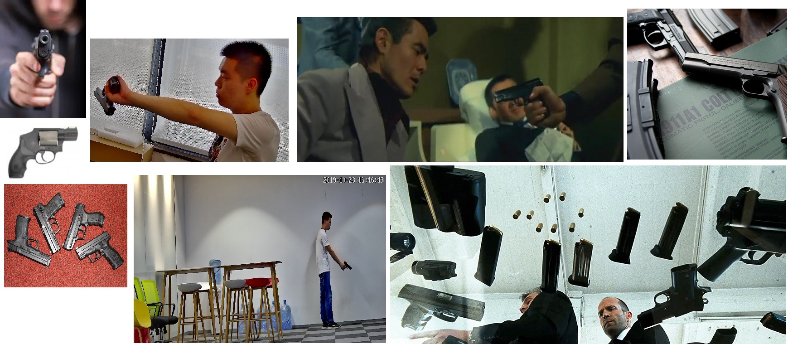

# Gun-Detection-In-Video-Using-Ultralytics-RT-DETR

In this repository [Ultralytics RT-DETR](https://docs.ultralytics.com/es/models/rtdetr/) is trained to detect guns. After training, the detector is used to detect guns in video. This is a more challenging problem compared to the license plate detection implemented in a previous [repository](https://github.com/GerardoRodriguezB/License-Plate-Detector-Using-YOLOv8.git). Guns vary significantly in shape, size, color, and orientation, and often appear partially occluded, either being held by a person or hidden in clothing. These factors make robust detection considerably harder.


## Dataset

The dataset used for this project is available [here](https://drive.google.com/drive/folders/1gp4zzNTbTmkgv5mpvzgdXIDXsZJInSzk) and was introduced in the following [research paper](https://ieeexplore.ieee.org/document/9659207). It consists of over 50,000 images taken from movies, surveillance cameras, and academic sources, annotated in Pascal VOC (XML) format.

The original dataset includes various weapon types: pistols, machine guns, shotguns, and long guns. For this project, we focused exclusively on handguns (pistols). A custom script was used to randomly sample 3,000 images and annotations, from which a manual selection of 400 training images and 100 validation images was made to ensure diversity.

The training/validation sets include:
- Bright and dark environments
- Various viewing angles
- Guns on white and custom backgrounds
- People near and far from the camera
- Guns of multiple shapes, sizes, and colors
- Different types of occlusion

Combined with Ultralytics' built-in data augmentation, this selection strategy helps the model generalize well to different scenarios. This repository includes the subset of images and labels (in YOLO format) used for training and validation. You can explore and retrain the model using these files or extend the dataset with additional samples. See below some images showing variety in trainig/validation datasets



## Environment Setup

Creeate an Anaconda environment using `python=3.10`. Navigate to the root folder of the project and install requirements

```bash
pip install -r requirements.txt
```


## Install PyTORCH

If your machine has a CUDA compatible GPU, install:


```bash
pip install torch==2.5.1 torchvision==0.20.1 torchaudio==2.5.1 --index-url https://download.pytorch.org/whl/cu118
```

Otherwise, install the CPU versions:

```bash
pip install torch==2.5.1 torchvision==0.20.1 torchaudio==2.5.1
```

## Video Detection

The `video` folder includes a test video featuring the author holding a toy gun. This video was processed using the trained detector, and the resulting annotated video is also included in the repository as `toy_gun_processed.mp4`.


